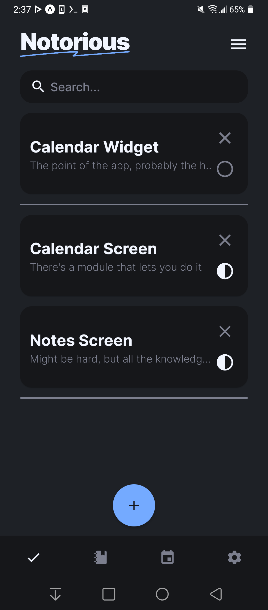
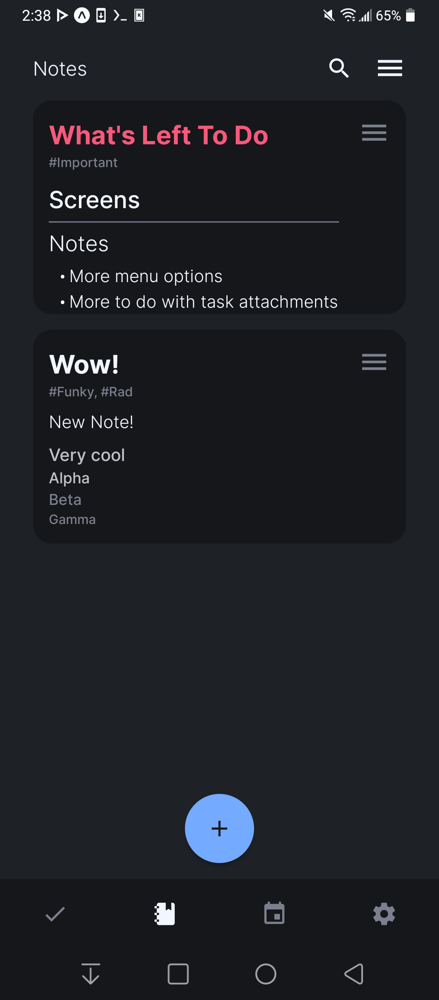
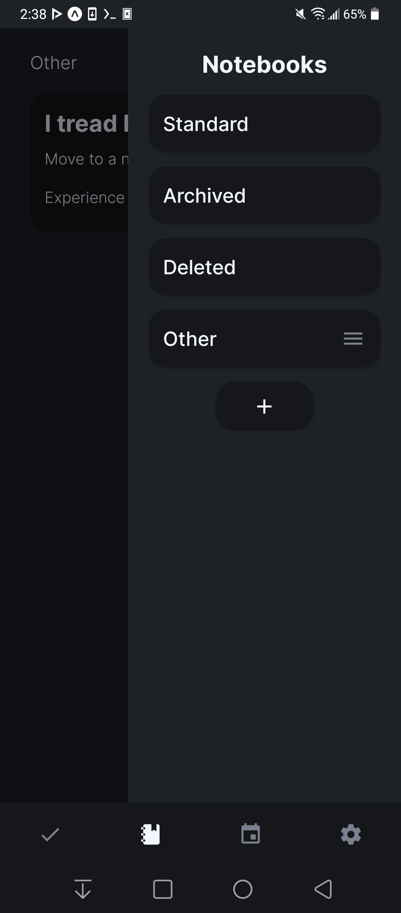
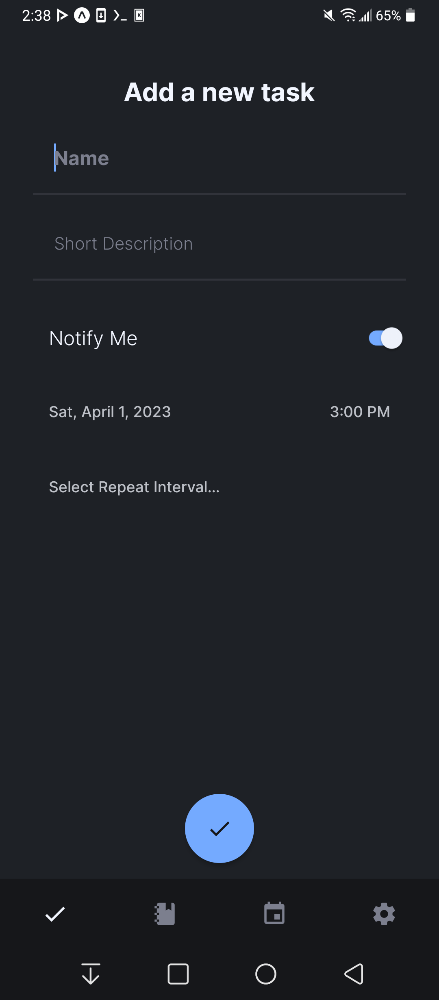
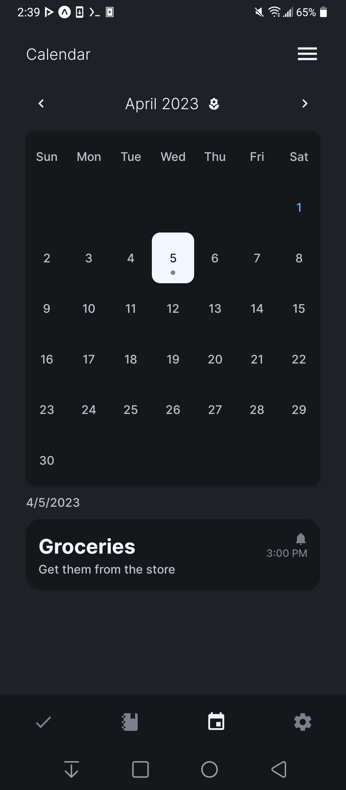

# Notorious

A simple note-taking app built using React Native. An app I made to get familiar with development using this framework, as well as something that will hopefully prove to be a useful productivity tool in the future.

## Gallery

<p float="left">
    
    
    
    
    
</p>

***

## Installation

Until I figure out how to build a bundled app, you will need to run/build this app manually.

Please note that currently, even though this app does use a cross platform framework, it will not work on iOS. I don't have a Mac to test this app on, so it is unlikely that I will be able to debug this app for iOS.

First, download the source code:

```
$ git clone https://github.com/Fr75s/notorious.git
$ cd bigscraperqt
```

Then, install all dependencies:

```
$ npm install expo
$ npx expo install
```

Finally, run the app.

```
$ npx expo start
```

OR

```
$ npx expo prebuild
$ npx expo run:android
```

***

## Currently Implemented

- All pages' basic functionality

## Potential Future Additions

- More organized settings page
- Notifications for notes
